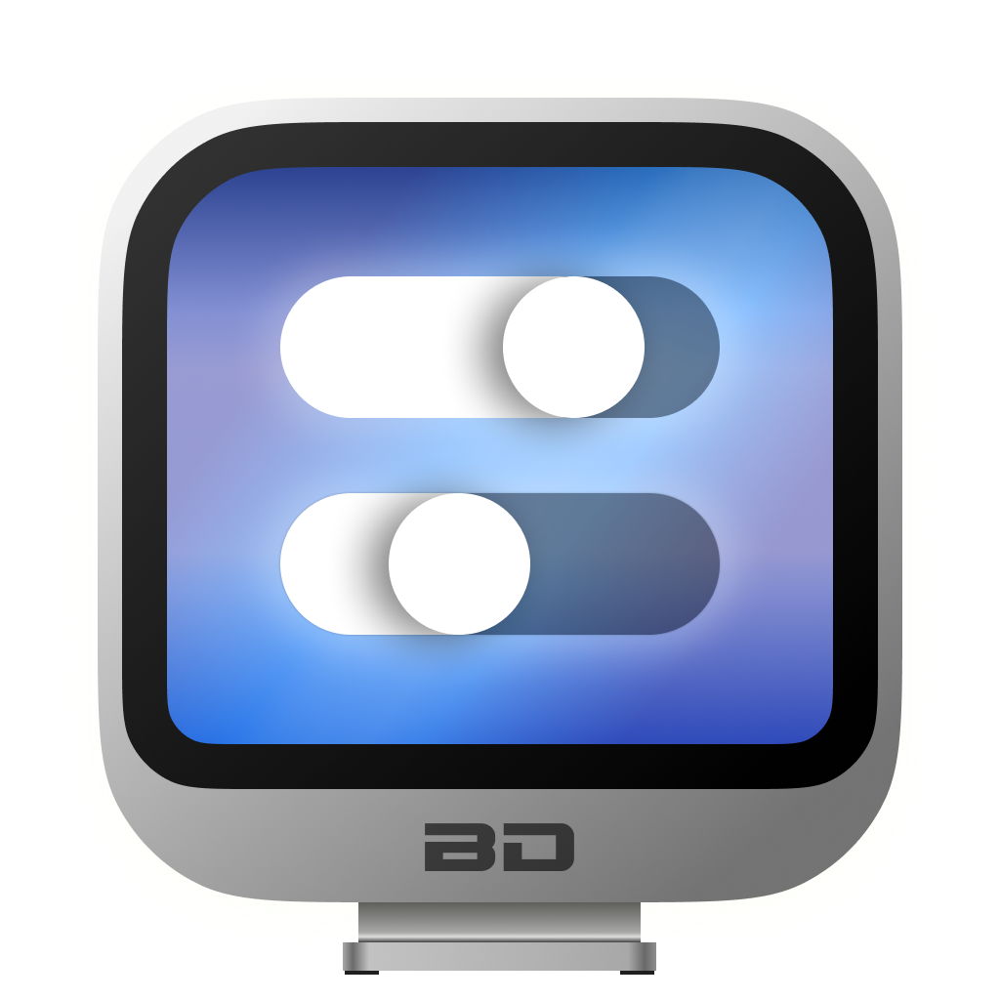
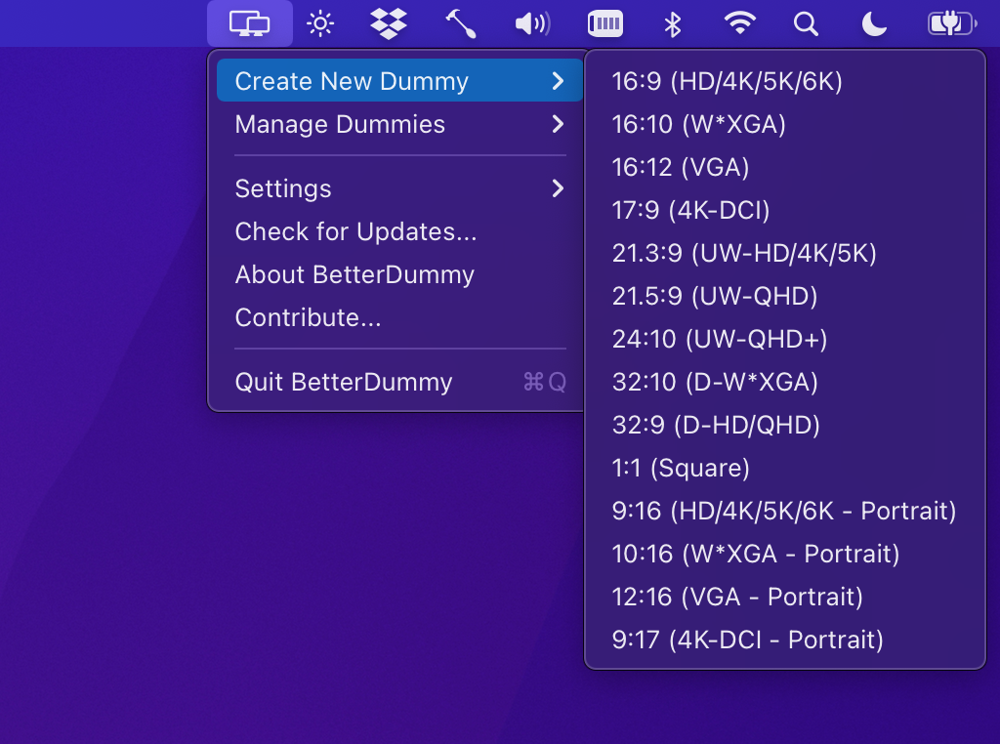
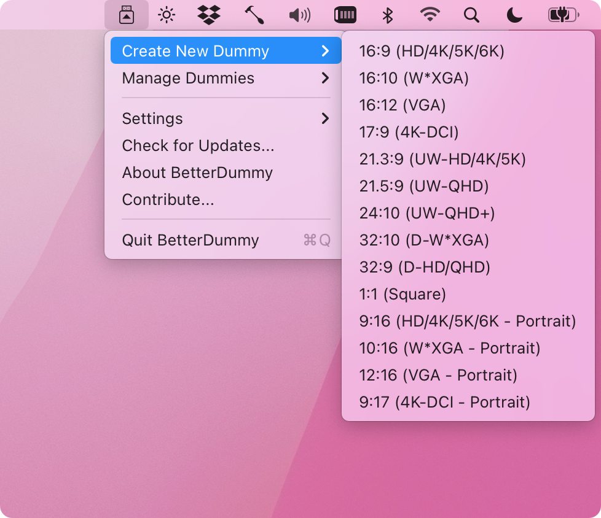
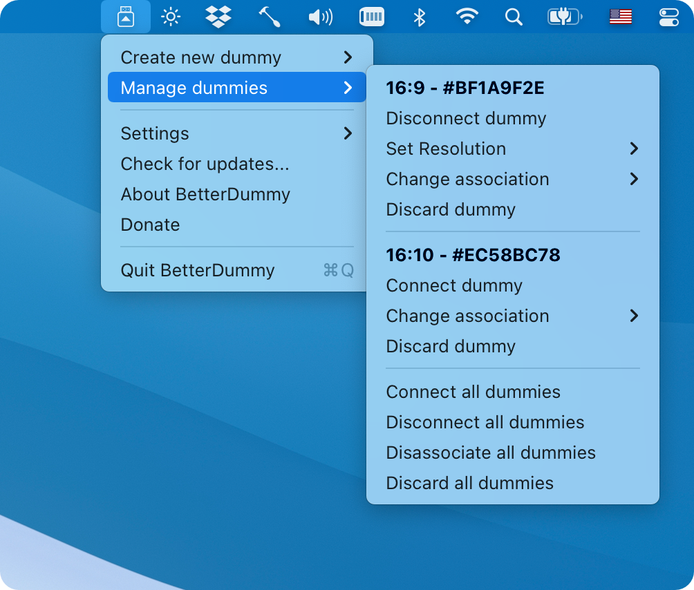
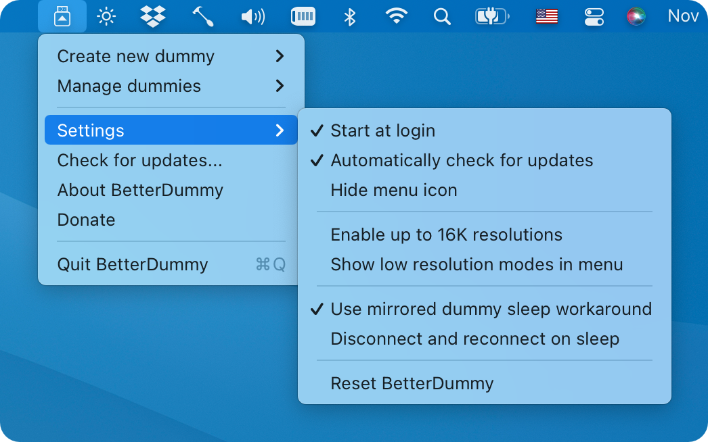

<h2>BetterDummy</h2>

Dummy Display for Apple Silicon Macs to Have Custom HiDPI Resolutions - an app from one of the makers of <a href="https://github.com/MonitorControl/MonitorControl">MonitorControl</a>.

 

<!-- shields -->
<!-- downloads -->

<!-- version -->

<!-- license -->

<!-- platform -->

<!-- backers -->

  

  
## About

Some Macs tend to have issues with custom resolutions. The new Apple Silicon Macs notoriously don't allow sub-4K resolution displays to have HiDPI ("Retina") resolutions even though most 1440p display would greatly benefit from having a HiDPI "Retina" mode. On other Macs the resolution options for wide displays are too constrained. To fix these issues, some resort to buying a 4K HDMI dummy dongle to fool macOS into thinking that a 4K display is connected and then mirror the contents of this dummy display to their actual monitor in order to have HiDPI resolutions available. Others use the built in screens of their MacBooks as a mirror source. These approaches have obvious drawbacks and limits.

BetterDummy solves the problem by creating a flexible virtual "dummy" display that supports an unprecedented range of Retina resolutions. You can then utilize this dummy display as a mirror source for your display achieving any HiDPI resolution.

Advantages of BetterDummy over a physical 4K HDMI dummy plug or mirroring your internal display:

- Your HDMI port will remain usable for an other display on the Mac Mini
- Your internal screen will be available as an extended space on a MacBook (or you can use clamshell mode).
- Does not suffer from issues that prevalent with the physical dummy (like jittery mouse cursor).
- Offers a much wider range of HiDPI and standard resolutions.
- Works with all aspect ratios, does not depend on what resoluations are recorded in the dummy's EDID/firmware.
- Available instantly.

Some other  uses:

- The app is  useful for anybody who is not satisfied with the offered default HiDPI resolutions offered by macOS.
- Use headless Macs (servers) with any resolution and HiDPI mode for remote access.
- Scale Sidecar resolutions.
- Better quality zooming (`System Preferences`»`Accessibility`»`Zoom`) or High Quality screenshots even on 1080p displays.
- You can use it instead of or alongside other apps that create custom native resolutions.

## Usage

1. Start the app
2. In the app menu choose `Create New Dummy` and select your desired aspect ratio
 

 
  
3. In `System Preferences` -> `Displays` you'll see the new Dummy display (for example `Dummy 16:9`)
4. Activate mirroring. The `Main` display should be the Dummy display
5. Set the Dummy display as `Optimize for`
6. Set the `Resolution` as `Scaled` (you should hold the `Option` key while clicking on the `Scaled` option for a full list of resolutions!) or use the app's own resolution selector located in the app menu.

8. Select the desired mode.

The app saves the dummy display configuration and automatically restores it upon next restart.

For more information on usage, see the [the additional help section](#additional-help).

Notes:

- The tutorial was compiled on macOS Monterey (for Big Sur as well - steps are slightly different, see [this article](https://macfinder.co.uk/blog/how-to-mirror-specific-displays-in-os-x-mirror-some-but-not-all-of-your-monitors-on-an-apple-system/) on how to customize mirroring on Big Sur).
- For most configurations, you'll see HiDPI 'Retina' resolutions in the list by default and see and additional non-HiDPI resolutions marked with a `(low resolution)` tag in the resolution list if `Show all resolutions` is toggled. On some configurations however, you might see HiDPI (high resolution) display modes marked with a `(HiDPI)` tag and standard resolutions _without a tag_.
- You might have to fight a bit with macOS Monterey's new `Displays` tab in Preferences as the `Optimize for` setting tends to reset at random times to the physical display for unknown reasons during changing settings. If this happens, you can set it back to the Dummy.
- You may want to enable the `System Preferences`»`Notifications & Focus`»`Allow Notifications`»`When mirroring or sharing the display` option to allow notifications when mirroring is turned on.

## Installation

- Download the [latest release](https://github.com/waydabber/BetterDummy/releases)
- Move the app to Applications
- Start the app
- Use the app menu bar item to interact.

## Supporting the project

I am thankful for each of you who [contributed to the project](https://opencollective.com/betterdummy). Every little bit helps! If you find use in the app and did not contribute so far, please consider a donation so I can continue working on this app. :) Thank you!

Super generous contributors, who donated $50 or more:

- Riten Jaiswal - $200
- Will_from_CA - $100
- Victor - $50

Notable contributors, who donated $20 or more:

- Felix
- Emilio P Egido
- Thomas Varghese
- Reactual
- Stephen Richardson
- Peter Szombati
- NP
- David Verdonck
- Knut Holm
- Jan Behrmann
- Danilo
- Andrew Braithwaite
- Splay Display
- Guest
- Incognito
- Florian Gross
- David Richardson
- Jari Hanhela
- William Edney
- David W
- Chetan Kunte
- Martin Clayton
- Nikola Milojević
- Wolf1701
- Arthur Müller
- Tom Dai
- Jeff Lopes

(list updated as of 13/12/2021)

Do you miss your name? [Join the list!](https://opencollective.com/betterdummy/donate)

Please don't forget to star the GitHub page and spread the word about the app. :)

## Compatibility

- The app should be compatible with all M1 class machines running macOS Monterey (MacBook Air, Mini, 2020 and 2021 MacBook Pros).
- The app is also compatible with more recent Intel Macs and macOS Big Sur but mirroring might not work as expected (testing was limited to a single Intel Mac with Intel UHD 630 running Big Sur).
- The app is compatible with headless mode as well (this was tested on Intel).

### Known issues

Please take a look at the [list of known issues](https://github.com/waydabber/BetterDummy/issues?q=is%3Aissue+is%3Aopen+sort%3Aupdated-desc+label%3A%22known+issue%22) before using the app or submitting an Issue.

### Enhancements

I am continuously working on improving the app. You can check out the [planned features and their status here](https://github.com/waydabber/BetterDummy/issues?q=is%3Aissue+is%3Aopen+sort%3Aupdated-desc+label%3Aenhancement).

## Some notable articles about BetterDummy

BetterDummy is now famous! :)

- https://www.theregister.com/2021/12/03/apple_m1_drivers
- https://9to5mac.com/2021/11/23/enable-1440p-retina-scaling-m1-mac/
- https://www.macworld.com/article/549493/how-to-m1-mac-1440p-display-hidpi-retina-scaling.html

Also the app made it to the featured news (once took the first spot) in Hacker News.

- https://news.ycombinator.com/item?id=29064234
- https://news.ycombinator.com/item?id=29469837

## Additional help

**The following section and the screenshots are somewhat outdated as they represent app version 1.0.10.**

For most of the time, the app is self explanatory but here is a brief overview of some of the additional functions in the app.

### Manage your dummies

 

- The `Manage dummies` submenu header contains some basic info about the dummy - its aspect ratio and unique serial number.
- `Connect dummy` / `Disconnect dummy` - You can easily connect or disconnect a dummy. Only dummes that are not associated to a display can be connected or disconnected manually.
- `Set resolution` - This allows for a quick resolution change. The list conatains all supported resolutions. If `Show low resolution modes` is enabled under `Settings`, then additional non-HiDPI resolutions are shown at the bottom of the list.
- `Associate with display` or `Change association` - You can associate a dummy to a real display. This will make the dummy automatically connect or disconnect whenever the display is connected or disconnected. It is useful when docking/undocking your macbook so you don't have to manage your dummy manually every time.
- `Discard dummy` - Destroys the dummy. Use it only if you don't need a dummy anymore - otherwise it is better to just disconnect or disassociate the dummy so macOS can remember the dummy for later use (by its unique serial number).

### App settings

 

- `Start at login`, `Automatically check for updates` - general options
- `Hide menu icon` - when the menu icon is hidden, you can still change settings - simply launch the app again while it is already running and the menu icon will reappear.
- `Enable up to 16K resolutions` - you can enable up to 16384x16384 resolution (this translates to 8192x8192 HiDPI). This is mostly useful for ultrawide and double-wide displays, where the standard 8192px max resolution might still be constraining. Use with caution as very high resolutions tax the system heavily.
- `Show low resolution modes in menu` will allow you to set low (non-HiDPI) resolutions in the app menu under `Manage dummies`
- `Use mirrored dummy sleep workaround` - macOS has a bug that makes virtual displays (like Sidecar, AirPlay, DisplayLink, BetterDummy) freeze when they act as a mirror main on some configurations. This workaround intends to solve that issue (more or less successfully).
- `Disconnect and reconnect on sleep` - This disconnects dummies upon sleeps and reconnects them after wake.
- `Reset BetterdDummy` - discard all dummies and reset all application settings to default.

## Don't forget to check out

**If you like BetterDummy, you'll like [MonitorControl](https://monitorcontrol.app) as well!** Control the brightness, volume of your external display like a native Apple display! The two apps are fully optimized to work togeteher.

## Thanks

- [@tml1024](https://github.com/tml1024)! - for FluffyDisplay as a starting point for this project
- [@w0lfschild](https://github.com/w0lfschild) - for maintaining reverse engineered macOS headers
- [@JoniVR](https://github.com/JoniVR) and [@the0neyouseek](https://github.com/the0neyouseek) - from MonitorControl

## Discord channel

You can join the (mostly self help) discussion on the new [BetterDummy discord channel](https://discord.gg/aKe5yCWXSp).
